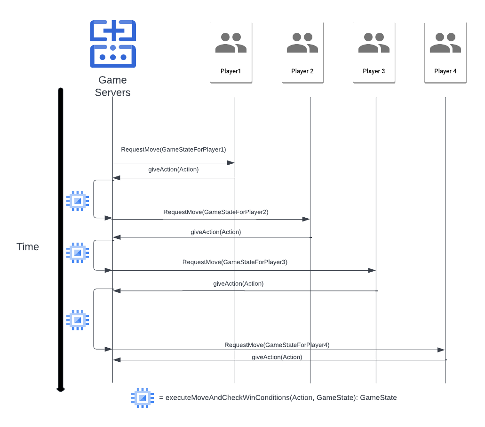

# Player-Referee Interaction Design

The end product we are working towards is a distributed system consisting of a single referee containing the truth
of the system, and several players that talk directly to the main server to perform their moves.

On startup (once the server has dealt with signing all players up), the referee will broadcast a message to all
players containing their necessary information: the initial board state, their treasure and home tile positions,
their avatar.

The referee will then perform the following actions sequentially for each player in a predetermined order, until it determines that the game is over.
- Send a `RequestMove(Board, PlayerInfor)` message, including the current board state and the player's position.
- The player will receive this message, interpret it in whatever way suits it best, and send the referee a
    `Action` message which is either a `Pass` object, or a `MoveAction` containing the row/column to shift, the direction to do it in, the degree to which the spare tile
    should be rotated, and what position to move the player to.
- Once the server receives this message, it will check its well-formedness, validity, and legality according to the rules 
of the game. If the move is fine, it will execute the move and update the current state of the game.
- Lastly, it will check the latest state of the game for winning or tying conditions. It will see if a player has
  reached its home tile after having found the treasure, or if the last _n_ (number of players) moves have been `Pass`.

Once the game is over, the referee will generate a `GameOver` message and broadcast it to all players. This message will either
say the game ended in a tie, or it will contain the winning player and its reward.

