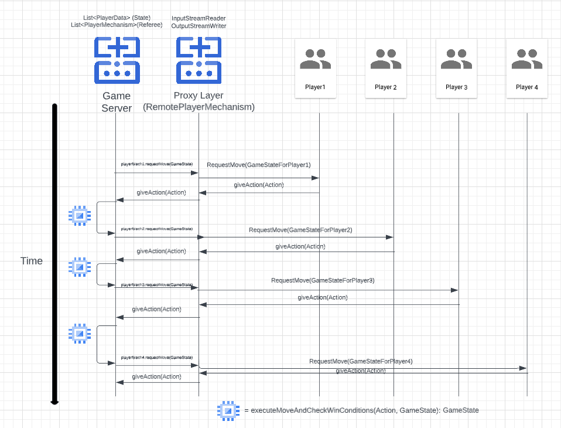

# Remote Player Proxy
Players connecting to our game will be done through the remote proxy pattern where a RemotePlayerMechanism 
wraps the TCP connection generated from our proxy server.

## Board set up
Our proxy server will listen for TCP connections, the proxy server will create a RemotePlayerMechanism instance on
the player behalf. It will then create a referee instance passing the RemotePlayerMechanisms that it has been storing.

********* decide start condition **** fall guys or among us 

## Starting the game

## Playing the game

## Ending the game
The referee will notify which players have won and which players lost. The referee will make a call to each 
player mechanism about their win state and the remote player mechanism will send the information downstream.

